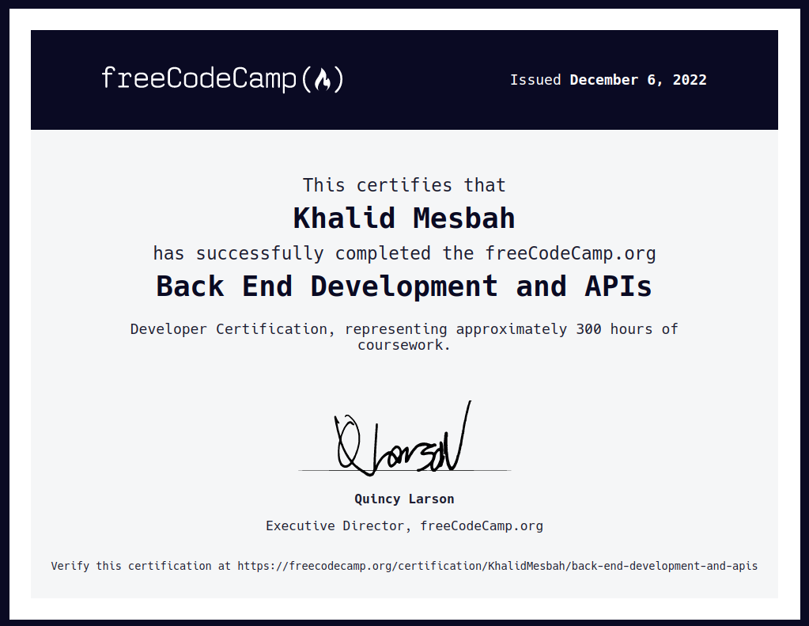

# Back-End-Development-and-APIs Solutions
> My solutions to the BackEnd Development And APIs Course Projects from freeCodeCamp.

## Credentials
[Show Credential](https://www.freecodecamp.org/certification/KhalidMesbah/back-end-development-and-apis)

## Completed Projects
- [x] Timestamp Microservice [Preview](https://boilerplate-project-timestamp.khalidmesbah1.repl.co)
- [x] Request Header Parser Microservice [Preview](https://boilerplate-project-headerparser.khalidmesbah1.repl.co)
- [x] URL Shortener Microservice [Preview](https://boilerplate-project-urlshortener.khalidmesbah1.repl.co)
- [x] Exercise Tracker [Preview](https://boilerplate-project-exercisetracker.khalidmesbah1.repl.co)
- [x] File Metadata Microservice [Preview](https://boilerplate-project-filemetadata.khalidmesbah1.repl.co)

## Certification

